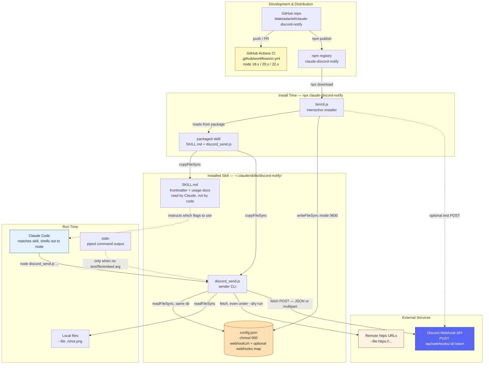
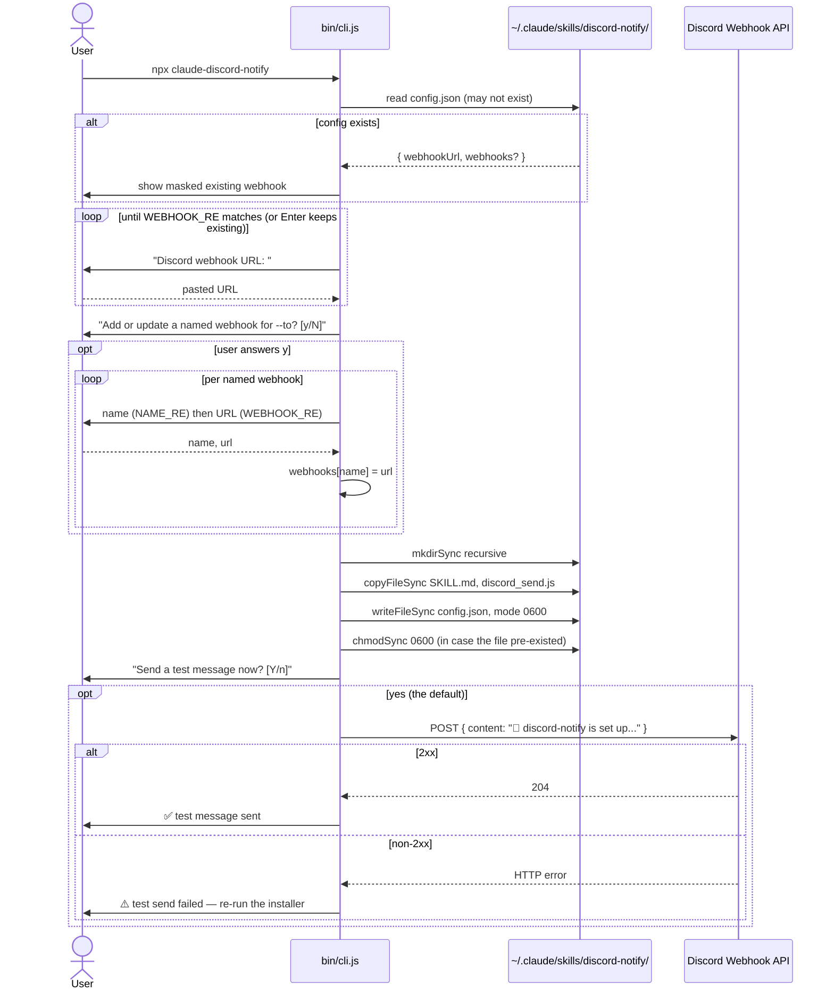
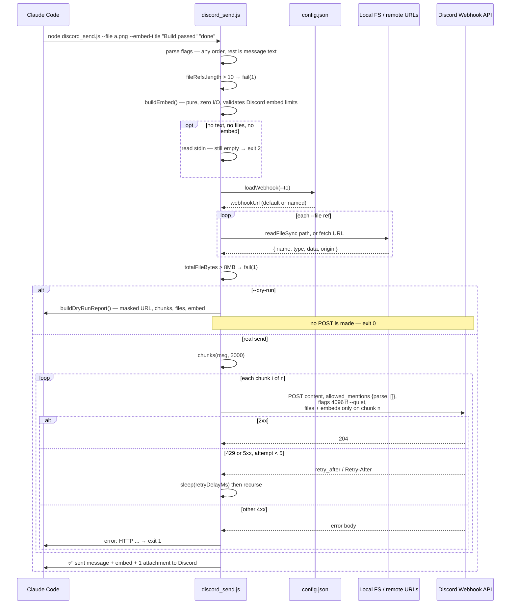
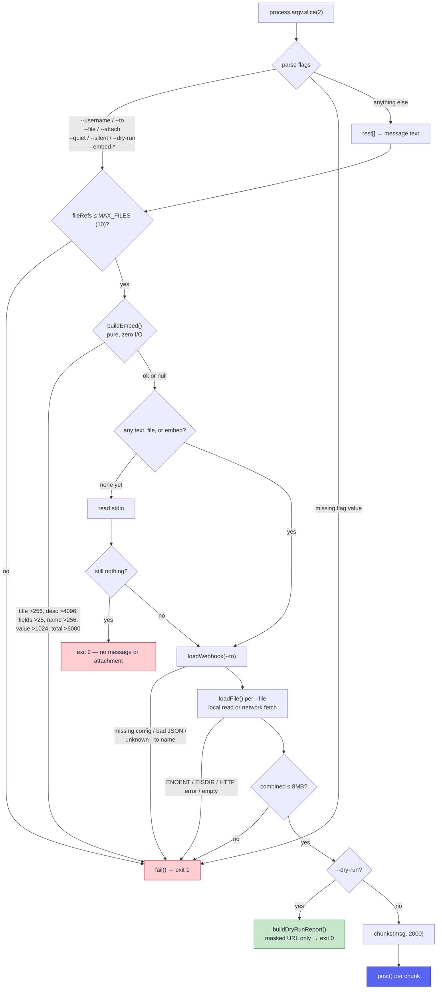
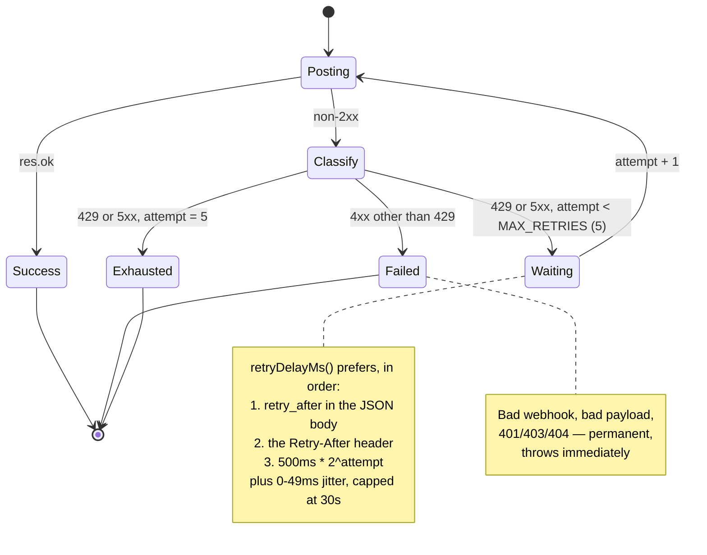
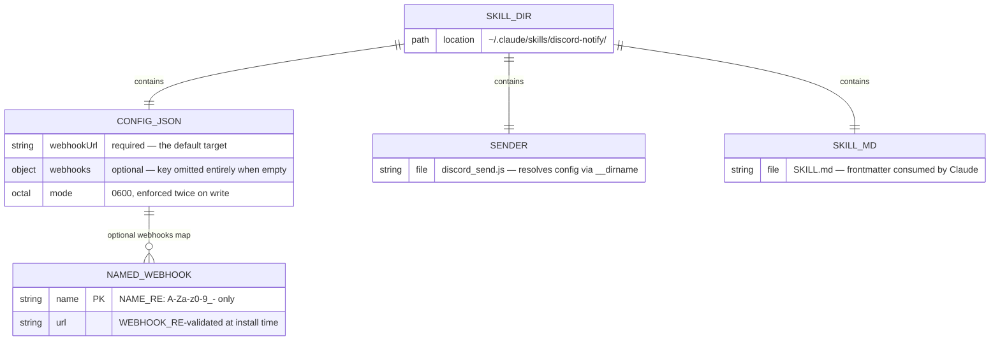
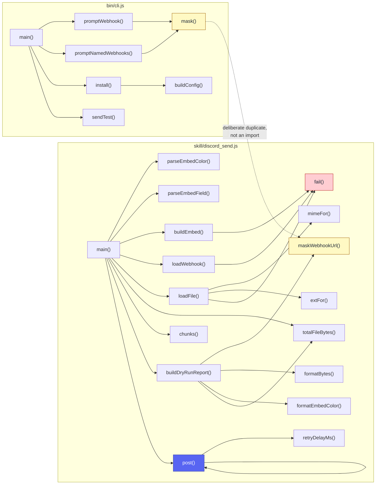
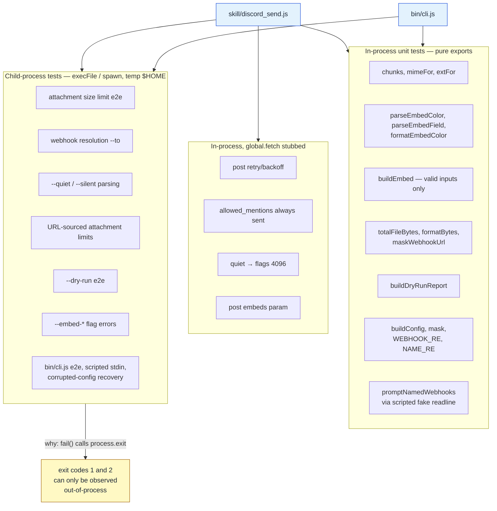
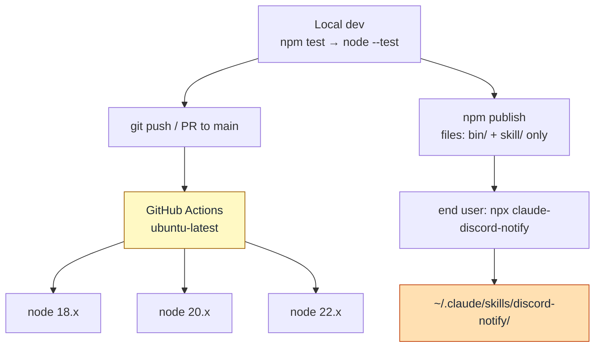
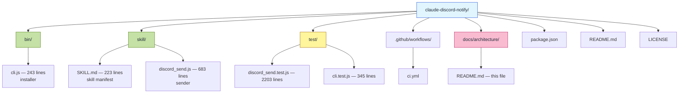

# System Architecture

`claude-discord-notify` is a zero-dependency Node.js package that installs a
Claude Code skill capable of posting messages, file attachments, and rich
embeds to a Discord channel through an incoming webhook.

## Overview

There is no server, no database, and no frontend. The system is two small
Node CLIs with **two completely separate lifecycles** that meet only through
one directory on disk:

| Lifecycle | Entry point | Runs | Talks to |
|---|---|---|---|
| **Install time** | [bin/cli.js](../../bin/cli.js) | Once, by the human, via `npx claude-discord-notify` | Terminal (readline), filesystem, Discord (one test POST) |
| **Run time** | [skill/discord_send.js](../../skill/discord_send.js) | Every time Claude sends a notification | Filesystem (config + attachments), Discord webhook API |

The installer's only job is to materialize `~/.claude/skills/discord-notify/`
with three files. The sender's only job is to read one of them and POST. They
never import each other — see [Key Design Decisions](#key-design-decisions).

## Architecture Style

**Two-phase CLI tool with file-based configuration.** Closest named pattern is
a *pipe-and-filter* command-line utility: text/args in → validation pipeline →
HTTP out. There is no long-lived process, no IPC, and no shared runtime state;
all state is the single `config.json` on disk.

## System Components

**Note on the dotted `SKILL.md → Claude` edge:** `SKILL.md` is never parsed by
any code in this repo. It is a prompt — Claude reads its frontmatter to decide
when the skill applies, and its body to decide which flags to pass. It is
"executed" by a language model, which makes it the one component whose
correctness the test suite cannot assert.

## Data Flow

### Install flow — `npx claude-discord-notify`

Re-running the installer is the documented way to change a webhook: existing
named webhooks are read back in and merged, and pressing Enter at the first
prompt keeps the current default. Skill files are always overwritten with the
packaged copies, so a re-run doubles as an upgrade.

### Send flow — `node discord_send.js ...`

## Validation Pipeline

The ordering here is deliberate and load-bearing: everything cheap and local
runs before anything that touches the network or the secret. `--dry-run` is
defined as *this entire pipeline minus the final POST*, which is what lets a
clean dry run guarantee a real send would also pass validation.

Two details worth calling out because they are easy to get wrong when editing:

- **`buildEmbed()` runs before `loadWebhook()`.** A malformed embed must not be
  able to trigger a config read or a network fetch.
- **URL attachments are genuinely fetched under `--dry-run`.** That is not an
  oversight — the reported size and MIME type must come from real bytes, and
  the 8MB check must be meaningfully exercised.

## Retry State Machine

`post()` is recursive: each retry re-enters `post()` with `attempt + 1`.

## Persistent State

`config.json` is the only thing this system stores. It is not a database; the
diagram below documents its shape and the one relationship inside it.

`buildConfig()` deliberately omits the `webhooks` key rather than writing
`"webhooks": {}`, so a user who never configures named channels gets the same
minimal two-line config the tool has always written.

## Module & Function Relationships

Both files are flat ES modules — no classes, so there is no class diagram to
draw. The real structure is the export surface, which exists almost entirely
so the test suite can reach pure logic without spawning a process.

## Test Topology

165 test cases across 35 suites (28 of them top-level `describe` blocks) —
roughly 2,550 lines of test against
930 lines of source. The suite splits into two strategies, and the split is
forced by `fail()`: it calls `process.exit(1)`, so every error path has to be
asserted from a child process rather than in-process.

## Distribution & CI

`engines.node` is `>=18` and CI matches it. That floor is real, not decorative:
the code uses global `fetch`, `FormData`, and `Blob`, plus
`node:readline/promises` — none of which exist on Node 16. `files` in
`package.json` ships only `bin/` and `skill/`, so tests and docs never reach a
user's machine.

## Directory Structure

Note that `skill/` is both source and payload: the directory is copied verbatim
to the user's machine at install time. There is no build step, no bundler, and
no transpile — what is in the repo is what runs.

## Key Design Decisions

### 1. The two CLIs never import each other

**Context:** `mask()` in the installer and `maskWebhookUrl()` in the sender are
the same six lines of code.

**Decision:** Duplicate it, and document the duplication in-source.

**Consequences:** `discord_send.js` stays a standalone file that can be copied
anywhere and run with `node` alone. Sharing a helper would mean shipping a
`lib/` the installer must also copy, or a bundling step. The cost is one
function that has to be changed in two places — bounded, and tested on both
sides.

### 2. Config lives next to the sender, resolved via `__dirname`

**Context:** The sender needs a webhook URL and no environment variable or CLI
flag supplies one.

**Decision:** `CONFIG_PATH = path.join(__dirname, "config.json")`.

**Consequences:** Zero configuration at call time — Claude just runs the script.
The trade-off is that **running `skill/discord_send.js` from a repo checkout
will not find a config**, because the checkout has no `config.json`; only the
installed copy under `~/.claude/skills/discord-notify/` does. That is why the
child-process tests build a temp `$HOME` and a temp skill dir rather than
invoking the repo file directly.

### 3. `allowed_mentions: { parse: [] }` is unconditional

**Context:** Claude generates the message text, and that text can contain
`@everyone` by accident.

**Decision:** Every outgoing payload sets it. There is no flag to turn it off.

**Consequences:** This tool can never ping a channel, full stop. `--quiet` is a
*separate*, orthogonal control — it sets the `SUPPRESS_NOTIFICATIONS` flag
(4096) to suppress the generic new-message notification, which is a different
mechanism from mention suppression. Both can apply to the same message.

### 4. `--dry-run` skips only the final POST

**Context:** A preview that skips validation would give false confidence.

**Decision:** Run the entire pipeline — including real network fetches for URL
attachments — and branch out only immediately before `post()`.

**Consequences:** A clean dry run is a genuine guarantee that the real send
would pass validation. The cost is that `--dry-run` is not free: it makes
network requests, just not to Discord. The report masks the webhook token, so
dry-run output is safe to paste back into a conversation.

### 5. Attachments and embeds ride the *final* message chunk

**Context:** Messages over 2000 characters are split into several Discord
messages.

**Decision:** Text chunks post in order; `files` and `embeds` are attached only
when `i === parts.length - 1`. `quiet` applies to every chunk, since it is a
per-message flag.

**Consequences:** Attachments visually follow the text they belong to. It also
means a multi-chunk send is N sequential API calls with N chances to hit a rate
limit — which is why the retry logic sits inside `post()` rather than around
the loop.

### 6. Exit code 2 is distinct from exit code 1

**Context:** "You gave me nothing to send" is a different failure from "the
thing you gave me is invalid."

**Decision:** Empty input exits 2; every `fail()` path exits 1.

**Consequences:** A caller can distinguish "nothing to do" from "something went
wrong" without parsing stderr.

## Security Architecture

- **The webhook URL is a bearer credential.** Anyone holding it can post to that
  channel. It is written with `mode: 0o600` and then `chmodSync(0o600)` again,
  because `writeFileSync`'s mode is ignored when the file already exists.
- **The URL is never printed in full.** The installer masks it when echoing an
  existing config; `--dry-run` prints only `maskWebhookUrl()` output plus the
  `--to` name. Both keep the numeric id and show 4 leading + 4 trailing token
  characters.
- **`WEBHOOK_RE` is an input filter, not a security boundary.** It constrains
  install-time input to `discord.com` / `discordapp.com` (plus `canary.` and
  `ptb.`) so a typo or a pasted non-Discord URL cannot become the send target.
  Note that it validates only at install time — a hand-edited `config.json` is
  used as-is.
- **Mention suppression is on by default** and not overridable (decision 3).
- **`--file` accepts arbitrary local paths.** The sender uploads whatever it is
  pointed at with no allowlist, so the caller decides what leaves the machine.
  In practice the caller is Claude, and `SKILL.md` is where that judgment is
  specified.

## Scalability & Performance

Scalability is not a meaningful axis here — one process, one message, then exit.
The limits that do bind are Discord's, and all of them are enforced locally
before any upload:

| Limit | Value | Constant |
|---|---|---|
| Message content | 2,000 chars | `MAX` |
| Attachments per message | 10 | `MAX_FILES` |
| Combined attachment size | 8 MB | `MAX_ATTACHMENT_BYTES` |
| Embed title / description | 256 / 4,096 chars | `EMBED_TITLE_MAX` / `EMBED_DESCRIPTION_MAX` |
| Embed fields | 25 | `EMBED_FIELDS_MAX` |
| Embed field name / value | 256 / 1,024 chars | `EMBED_FIELD_NAME_MAX` / `EMBED_FIELD_VALUE_MAX` |
| Embed combined total | 6,000 chars | `EMBED_TOTAL_MAX` |
| Retries before giving up | 5 | `MAX_RETRIES` |
| Backoff base / cap | 500 ms / 30 s | `BASE_DELAY_MS` / `MAX_DELAY_MS` |

Files are read fully into memory as Buffers; at an 8 MB ceiling that is fine and
streaming would add complexity for no gain.

## Observability

There is none beyond process output, and that is proportionate. Success prints
`✅ sent <what> to Discord` to stdout; failures print `error: ...` to stderr and
exit non-zero. Retries are silent — a caller sees only the final outcome. The
installer surfaces a failed test send as a warning with a re-run hint rather
than aborting, since the skill files are already installed correctly at that
point.

## Known Extension Points

Deliberate scope boundaries, documented in `SKILL.md` so Claude declines rather
than improvises around them:

- **Exactly one embed per invocation.** No `--embed-url`, `--embed-footer`,
  `--embed-image`, `--embed-thumbnail`, `--embed-author`, `--embed-timestamp`,
  and no multi-embed support.
- **8 MB attachment ceiling** is Discord's non-boosted default. Boosted servers
  allow more; the constant is not currently configurable.
- **Webhooks only.** No bot token, so no reading messages, no reactions, no
  threads, no editing or deleting after send.
